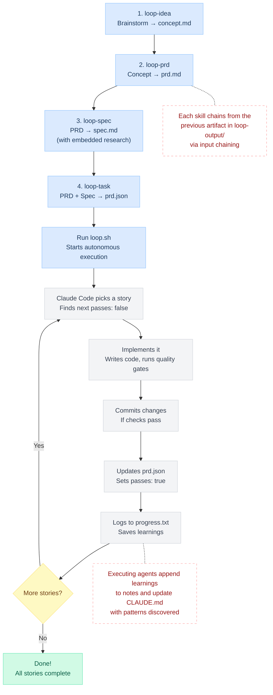

# Loop

An autonomous AI coding agent pipeline built on Claude Code. You describe what you want to build through a series of guided skills, then Loop executes it — story by story, commit by commit — with no human in the loop.

## How It Works

Loop has two phases: **design** (you + AI collaborating) and **execution** (AI working autonomously).

During design, you walk through 4 interactive skills that progressively refine a raw idea into an implementation-ready task list. Each skill produces a timestamped artifact in `loop-output/` and automatically chains into the next — it finds the most recent prior artifact and asks you to confirm.

During execution, `loop.sh` spawns Claude Code in a headless loop. Each iteration picks up the next unfinished user story from `prd.json`, implements it, runs quality checks, commits, marks the story as done, and logs what it learned. The next iteration reads those learnings before starting. When every story passes, the loop stops.

After execution, an optional evaluation skill audits the implementation against the original spec, scores deviations, and can promote the spec to a `finalspec` if the build is faithful.



---

## Prerequisites

- **[Claude Code](https://docs.anthropic.com/en/docs/claude-code)** — Anthropic's CLI for Claude. Loop shells out to `claude` in headless mode during execution.
- **[Context7 MCP Server](https://github.com/upstash/context7)** — Provides live library documentation lookup. The `loop-spec` skill uses Context7 to research technical decisions (e.g., querying current Drizzle ORM docs for migration syntax, checking Next.js patterns). Without it, the spec phase falls back to web search only and may produce less accurate technical recommendations. Set up as an MCP server in your Claude Code configuration.
- **jq** — Used by `loop.sh` to read `branchName` from `prd.json` for branch management and archiving.

---

## The Pipeline: Design Phase

| # | Skill | Mode | Input | Output |
|---|-------|------|-------|--------|
| 1 | `loop-idea` | Interactive | Your rough idea | `loop-output/concept-[timestamp].md` |
| 2 | `loop-prd` | Interactive | Concept doc + your answers | `loop-output/prd-[timestamp].md` |
| 3 | `loop-spec` | Interactive → Research → Output | PRD + codebase + research | `loop-output/spec-[timestamp].md` |
| 4 | `loop-task` | Autonomous | PRD + spec | `loop-output/prd-[timestamp].json` |

### Skill 1: `loop-idea` — Brainstorm

Turns a vague idea into a clear concept document through guided dialogue. The agent asks 6–7 focused questions — one at a time, with multiple-choice options when helpful — covering the core concept, problem, audience, distinctiveness, and trade-offs. You end up with a plain-English document that anyone can read.

**Output:** `loop-output/concept-[timestamp].md`

### Skill 2: `loop-prd` — Product Requirements

Creates a structured Product Requirements Document. Picks up the concept doc if one exists, then asks iterative questions about goals, scope, timeline, constraints, success metrics, and quality gate intent. The quality gate question is required — it captures what standards every story must meet (type checking, linting, tests, visual verification) without specifying exact commands yet.

**Output:** `loop-output/prd-[timestamp].md` with user stories, acceptance criteria, functional requirements, and quality gate intent.

### Skill 3: `loop-spec` — Technical Specification

Transforms the PRD into a technical implementation spec. Runs in three phases:

1. **Interactive** — Scans the PRD and existing codebase, identifies up to 3 technical decisions that need your input, and asks as multiple-choice questions.
2. **Autonomous research** — Uses the Context7 MCP server to query live library documentation and web search to validate technical decisions. Finds current best practices, version-specific patterns, and integration approaches.
3. **Output** — Produces a spec with architecture, data models, API contracts, component structure, error handling, testing strategy, and security considerations. Research findings are embedded inline (no separate research doc). Quality gate intent from the PRD gets translated into specific commands for the project's tech stack (e.g., "must pass type checking" → `pnpm typecheck`).

**Output:** `loop-output/spec-[timestamp].md`

### Skill 4: `loop-task` — Task Conversion

Converts the PRD + spec into the `prd.json` format that `loop.sh` consumes. Each user story becomes a JSON entry with:

- **`references`** — Links to relevant spec sections (e.g., `spec-TIMESTAMP.md#data-model`) so executing agents can look up technical details.
- **`notes`** — Pre-populated implementation hints from the spec (e.g., "Use Drizzle pgEnum for status column").
- **`priority`** — Dependency-ordered. Schema changes first, then backend logic, then UI.
- **`passes: false`** — Every story starts unfinished.

The key constraint: each story must be completable in **one Loop iteration** (one context window). If a story is too big, the agent runs out of context before finishing. Rule of thumb: if you can't describe the change in 2–3 sentences, split it.

**Output:** `loop-output/prd-[timestamp].json`

---

## Execution Phase: `loop.sh`

```bash
./loop.sh              # Default: up to 20 iterations, auto-finds prd.json
./loop.sh 10           # Cap at 10 iterations
./loop.sh path/to/prd.json   # Use a specific prd.json
./loop.sh 10 path/to/prd.json # Both
```

### What happens each iteration

1. `loop.sh` invokes Claude Code in headless mode (`claude -p --print --dangerously-skip-permissions`) with the contents of `CLAUDE.md` as the prompt.
2. The agent reads `prd.json` from `loop-output/` (falls back to project root).
3. It reads `progress.txt`, checking the **Codebase Patterns** section first for learnings from prior iterations.
4. It checks out or creates the branch specified in `prd.json`'s `branchName`.
5. It picks the highest-priority story where `passes: false`.
6. It implements that single story.
7. It runs quality checks (typecheck, lint, test — whatever the project requires).
8. If checks pass, it commits with message: `feat: [Story ID] - [Story Title]`.
9. It sets `passes: true` on the completed story in `prd.json`.
10. It appends a progress entry to `progress.txt` with what was built, files changed, and learnings.
11. If all stories now pass → outputs `<promise>COMPLETE</promise>` and the loop exits.
12. If stories remain → the iteration ends, `loop.sh` sleeps 2 seconds, and starts the next iteration.

### How agents learn across iterations

Each iteration is a **fresh Claude Code instance** with no memory of prior work. Knowledge transfer happens through files:

- **`progress.txt`** — Every iteration appends what it did and what it learned. The next iteration reads this before starting.
- **Codebase Patterns section** — A consolidated section at the top of `progress.txt` with the most important reusable patterns (e.g., "always use `IF NOT EXISTS` for migrations"). Agents promote learnings here when they're generally useful.
- **`CLAUDE.md`** — Agents update this with genuinely reusable knowledge that would help future work beyond the current run.

### Archiving previous runs

When `loop.sh` detects a different `branchName` than the last run, it archives the previous run's `prd.json` and `progress.txt` to `archive/YYYY-MM-DD-feature-name/` and resets `progress.txt`.

---

## Post-Execution: Skill 6 — `loop-evaluate`

| # | Skill | Mode | Input | Output |
|---|-------|------|-------|--------|
| 6 | `loop-evaluate` | Autonomous | spec + prd.json + progress.txt + codebase | `loop-output/closing-report-[date].md` + optional `finalspec` |

An optional skill you run after all stories are complete. It performs three phases:

### Phase 1: Closing Report

Reads `progress.txt`, `prd.json`, the git log, and the actual source files to produce a performance report: iteration-by-iteration breakdown, what was built, lines of code, test coverage, agent behavioral observations, and a final scorecard.

### Phase 2: Spec Audit

Exhaustive point-by-point comparison of the spec against the actual implementation. Every source file is read (not sampled). Each spec section is scored on a 100-point scale:

| Section | Points |
|---------|--------|
| Module Layout | 10 |
| Data Model | 15 |
| Database Schema | 15 |
| Component Structure | 25 |
| API Contracts | 15 |
| Error Handling | 10 |
| Testing Strategy | 5 |
| Security | 5 |

Deviations are classified: **Match**, **Enhancement** (agent added beyond spec — no penalty), **Spec Bug Fixed** (agent corrected a flawed spec — no penalty), **Alternate Approach** (different implementation, same behavior — no penalty), **Minor Deviation**, **Major Deviation**, or **Missing**.

### Phase 3: Promotion Decision

- **100/100** — Spec is auto-promoted to `finalspec-[timestamp].md` with status changed to Final.
- **90–99** — Deductions are presented as code bugs (not spec bugs). User decides whether to promote.
- **< 90** — Recommendation to fix deviations in a follow-up Loop cycle before promoting.

---

## Artifact Chain

A complete Loop run produces these artifacts in `loop-output/`:

```
loop-output/
├── concept-2026-02-07T01-06-54Z.md          # Skill 1: idea → concept
├── prd-2026-02-07T02-10-16Z.md              # Skill 2: concept → PRD
├── spec-2026-02-07T02-27-20Z.md             # Skill 3: PRD → spec
├── prd-2026-02-07T03-00-00Z.json            # Skill 4: spec → executable tasks
├── closing-report-2026-02-07.md             # Skill 6: post-execution report
└── finalspec-2026-02-07T02-27-20Z.md        # Skill 6: promoted spec (if audit passes)
```

Each artifact is immutable once created. The timestamp preserves the order and traceability. The `finalspec` timestamp matches its source spec (not the evaluation date) so you can always trace back.

---

## prd.json Schema

```json
{
  "project": "MyApp",
  "branchName": "loop/feature-name",
  "description": "Feature description",
  "userStories": [
    {
      "id": "US-001",
      "title": "Story title",
      "description": "As a [user], I want [feature] so that [benefit]",
      "acceptanceCriteria": ["Criterion 1", "Typecheck passes"],
      "references": ["loop-output/spec-TIMESTAMP.md#section"],
      "notes": "Implementation hints from spec.",
      "priority": 1,
      "passes": false
    }
  ]
}
```

| Field | Purpose |
|-------|---------|
| `branchName` | Git branch for execution. Auto-created from `main` if it doesn't exist. |
| `priority` | Execution order. Lower = first. Must respect dependencies (schema before UI). |
| `passes` | Set to `true` by the executing agent after the story is implemented and quality checks pass. |
| `references` | Pointers into the spec so the agent knows where to look for technical details. |
| `notes` | Implementation hints pre-populated from the spec. Agents may append learnings. |

---

## Directory Structure

### Tracked (in repo)

```
loop/
├── .claude/skills/                    # Skill definitions (the design pipeline)
│   ├── loop-idea/SKILL.md            # Skill 1: brainstorm → concept
│   ├── loop-prd/SKILL.md             # Skill 2: concept → PRD
│   ├── loop-spec/SKILL.md            # Skill 3: PRD → spec (with research)
│   ├── loop-task/SKILL.md            # Skill 4: PRD + spec → prd.json
│   └── loop-evaluate/SKILL.md        # Skill 6: post-execution audit
├── CLAUDE.md              # Agent instructions — the prompt each iteration receives
├── README.md              # This file
├── loop.sh                # Execution loop — spawns Claude Code per iteration
├── loop-bash-prompt.md    # Agent instruction template for Skill 5 (sandbox execution)
├── prd.json.example       # Example prd.json for reference
├── loop-flowchart.md      # Mermaid flowchart of the full pipeline
└── .gitignore
```

> **Note on skill numbering:** Skill 5 (`loop-bash`) is a planned feature for spawning multiple Claude Code instances in parallel sandboxes (Proxmox-based). It's in development on a separate branch. Skills are numbered to preserve ordering once it ships.

