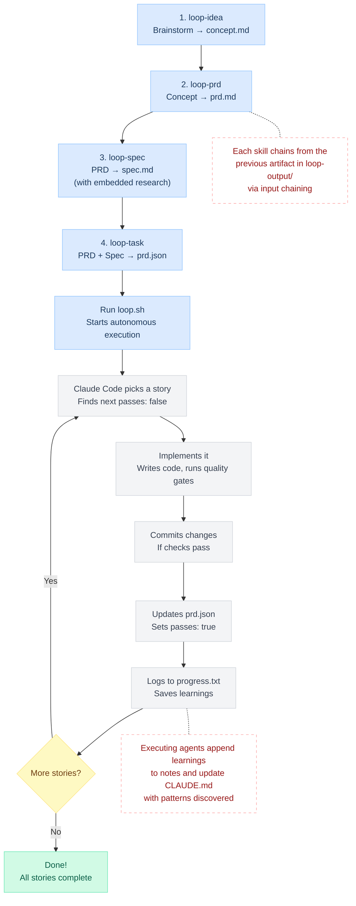

# Loop Flowchart

```mermaid
flowchart TD
    A["1. loop-idea<br/>Brainstorm → concept.md"]
    B["2. loop-prd<br/>Concept → prd.md"]
    C["3. loop-spec<br/>PRD → spec.md<br/>(with embedded research)"]
    D["4. loop-task<br/>PRD + Spec → prd.json"]
    E["Run loop.sh<br/>Starts autonomous execution"]
    F["Claude Code picks a story<br/>Finds next passes: false"]
    G["Implements it<br/>Writes code, runs quality gates"]
    H["Commits changes<br/>If checks pass"]
    I["Updates prd.json<br/>Sets passes: true"]
    J["Logs to progress.txt<br/>Saves learnings"]
    K{"More stories?"}
    L["Done!<br/>All stories complete"]

    A --> B --> C --> D --> E --> F --> G --> H --> I --> J --> K
    K -- "Yes" --> F
    K -- "No" --> L

    CHAIN["Each skill chains from the<br/>previous artifact in loop-output/<br/>via input chaining"]
    LEARN["Executing agents append learnings<br/>to notes and update CLAUDE.md<br/>with patterns discovered"]

    B -.- CHAIN
    J -.- LEARN

    classDef blue fill:#dbeafe,stroke:#93c5fd,color:#1e3a5f
    classDef gray fill:#f3f4f6,stroke:#d1d5db,color:#374151
    classDef yellow fill:#fef9c3,stroke:#fde68a,color:#713f12
    classDef green fill:#d1fae5,stroke:#6ee7b7,color:#065f46
    classDef note fill:#fff,stroke:#fca5a5,stroke-dasharray:5 5,color:#991b1b

    class A,B,C,D,E blue
    class F,G,H,I,J gray
    class K yellow
    class L green
    class CHAIN,LEARN note
```
